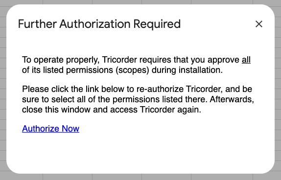

# granularOAuth
A collection of helpful functions for Apps Script powered scripts, Add-ons and Chat Apps for checking if all of a script's OAuth scopes (as listed in the project's manifest file) have been authorized/granted by the end-user, and if not, then to prompt the user to re-authorize.

## List of functions:
+ authHandleMissingScopeGrants(): Returns true if some or all scopes in the manifest have not been granted, and a prompt has been shown to the end-user to re-authorize. Returns false otherwise.
+ authUserHasGrantedAllScopes(): Returns true if some or all scopes in the manifest have not been granted. Returns false otherwise.
+ authCheckForMissingScope(scopeId): Returns true if the passed scope ID (i.e. 'https://www.googleapis.com/auth/drive.file') is missing from those granted by the end-user.

## Configuration:

You will need to copy/paste the code in granularAuth.gs into your Apps Script project, and then make the following changes:
+ Change the const AUTH_APP_NAME at the top of the file to reflect your app's name.
+ If needed, change the objects listed in the ADD_ON_CONTAINERS array to reflect the Editors your Add-on operates in.
+ If desired, update and/or localize the message strings in the function _showAllScopesRequiredMessage().

## Example use:

```
// Check if user has granted/authorized *all* scopes listed in this 
// project's manifest, and if not, provide them a link to grant the
// remaining ones. This check should be done at the start of any entry 
// point into your app that a brand new user may execute (i.e. Menu 
// items for them to start using your app). 

function menuItemStartAction() {
  if (authHandleMissingScopeGrants()) {
    // user needs to grant access to some or all scopes before normal
    // app execution can continue.
    return;
  }
  
 // continue with normal execution
 handleStartAction();
}
```
## Sample of prompt seen by the end-user:

